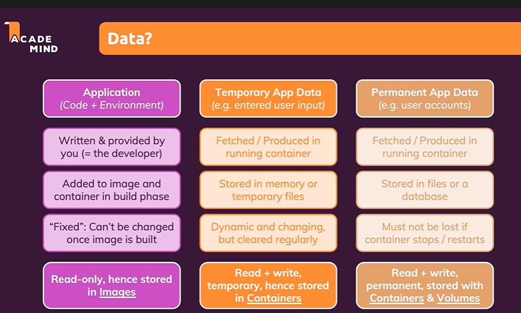
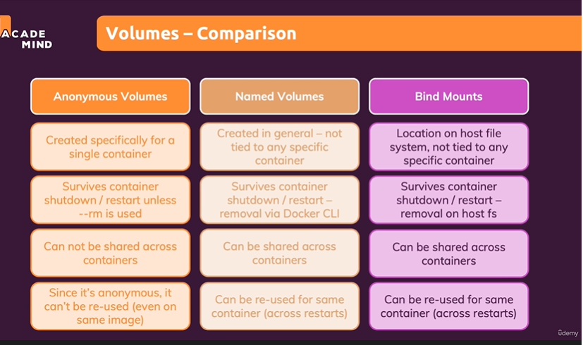

What we learn?
    Volumes
    

1. If container stopped and started - data exists
2. If container removed - data lost
    Solution?
3. VOLUMES
    volumes are folders on your host machine hard drive which are mounted in to containers.
    Containers can read/write data into volumes
4. In data-volumes-01 = permanant data is storing in feedback
    VOLUME ["/app/feedback"] in dockerfile - Anonymous volumes
    attached to container
5. Named Volumes:
    docker run -d --rm -p 3000:80 -v feedback:/app/feedback feedback:volume
    still there after container dies
6. docker volume rm VOL_NAME

============== Bind Mounts =================
You define a folder /path on your host machine

we attach to source code not COPY from docker file

$ docker run -d -p 3000:80 `
  -v feedback:/app/feedback `
  -v node_modules:/app/node_modules `
  -v "D:\Interview-codes\Docker-k8s-udemy\module-2\data-volumes-01-starting-setup:/app" `
  feedback:volume

  

$ docker run -d -p 3000:80 `
  -v feedback:/app/feedback `
  -v node_modules:/app/node_modules `
  -v "D:\Interview-codes\Docker-k8s-udemy\module-2\data-volumes-01-starting-setup:/app:ro" `
  feedback:volume

Bind mount doesn't managed by docker
Anonymous and Named - managed by docker

Anonymous - stays untill the container runs
Named - 

Memory Tip:

Bind Mount = Development (live code sync)
Named Volume = Persistent application/database data
Anonymous Volume = Docker-managed temporary persistence

Anonymous Volume: Auto-created, persistent data, no real-time code sync.
Named Volume: User-named, persistent data, reusable across containers, no real-time code sync.
Bind Mount: Uses host directory, persistent on host, supports real-time code sync.

